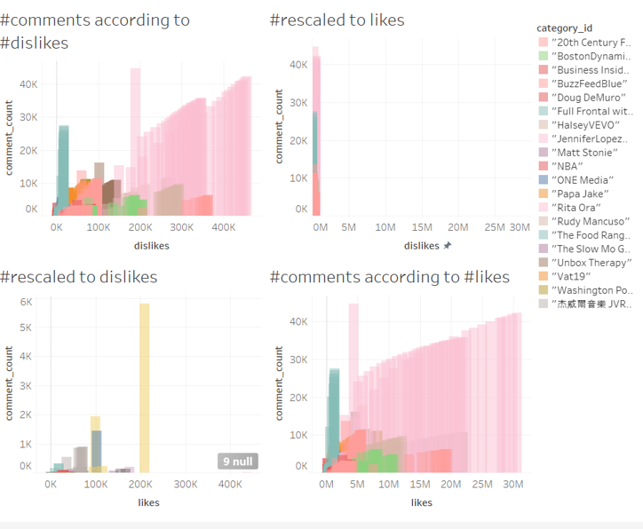
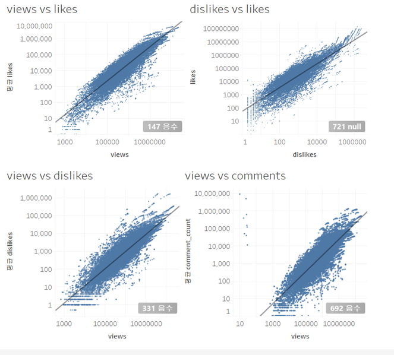
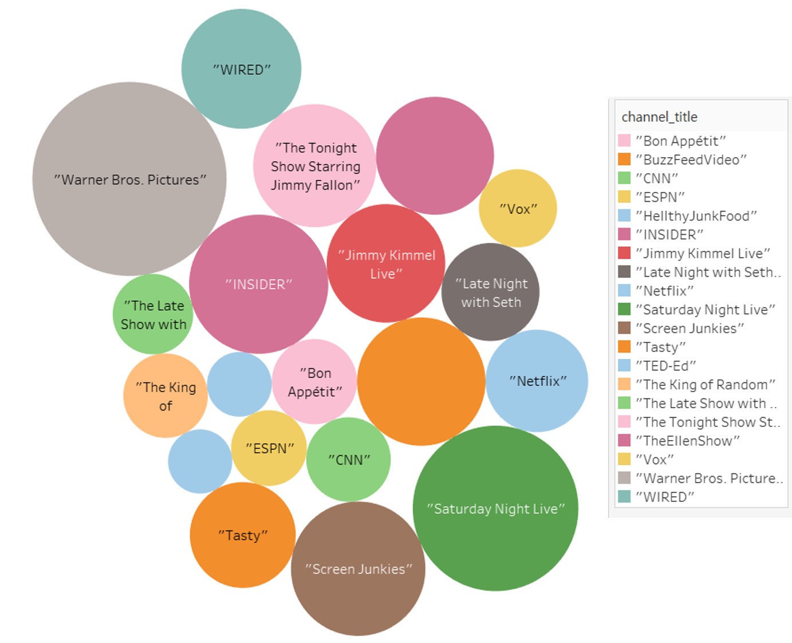
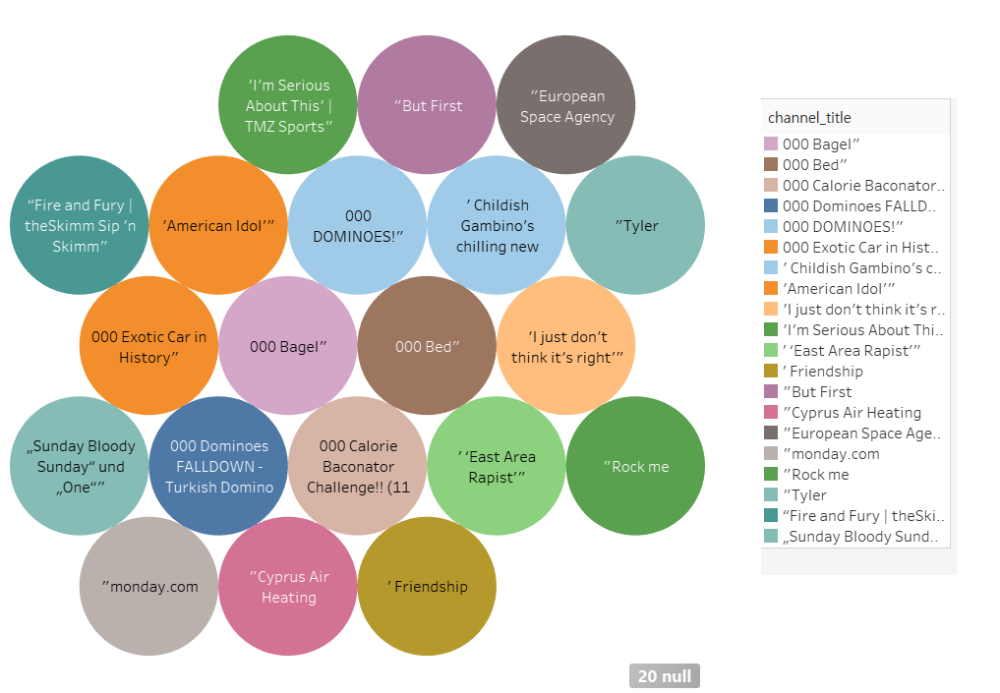

# Visual Exploration: Youtube Trending Stats data(Kaggle, 2019 ver)
- Team C 2018-20695 손선일

# 1. Tool: Tableau 2019.4
# 2. Dataset details
- Youtube dataset (https://www.kaggle.com/datasnaek/youtube-new/data)
- Jan 2017 ~ May 2018
- US: 6352 lines of data, 16 columns (15% of the total)
- (but w/o preprocessing useful traits limits to ~6 values)
- this report only contains analysis w/o preprocessings
# 3. Plots
## number of like/dislike vs number of comments 

## views vs _______

## channels top 20

## channels bot 20

# 4. 3 Interesting Findings
- Still traditional TV show videos views is on top  
  - expected to be short clips considering majority of user group age, but not could be found in this data.
- Based on view, number of comments, likes, dislikes are in power relation
- there were no outstanding outliers biased toward likes or dislikes: People are jealous or ignorant.

# 5. How tool helped you finding this
- Regression tool made me find this faster (otherwise I need to use excel which often get crashed)
- Filtering of the traits helped me irrelevant / annoying distractors--inappropriate parsing of the category_ids 
  - (e.g. Null, 0,1,2,3,43, ... etc.) 

# 6. Positive/Negative Aspects and Suggestions
- Data: No video running time? 
- Versatility: Can do almost any visualization / Complexity of the tool
- 데이터 밀려서 로딩되는거 몰랐으면 그냥 채널명 이외에 1,2,3,4 인덱스 그냥 파싱 잘못된거인줄 알 뻔 함...(그래서 여기 분석은 다 채널 기준이고 토픽기준이 아님)
- If there were python script loader for data processing core algorithm, wouldn't this be cool?  
